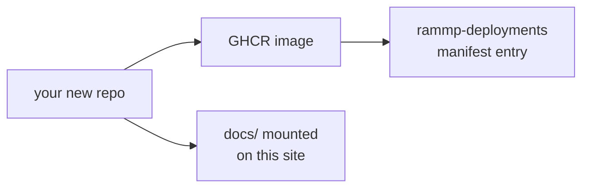

import { Cards, Callout } from 'nextra/components'

{/* Drafting note: _[bracketed italics]_ marks a phrase to replace, and a
    "> **Fill in** …" blockquote marks a whole section still to write. Inside
    code blocks, <angle-brackets> mark the values to replace. */}

# How to contribute

RAMMP is a polyrepo, meaning that each component of the software system lives in its own respository. This means that when you contribute a new module to the system, you are creating a whole repo of your own that ships as a Docker image and gets launched by [sheppy](/sheppy) alongside everyone else's.

## The shape of a contribution

| Stage | What you produce | Where it lives |
| --- | --- | --- |
| Write the module | A repo from the module template | `rammp-org/<your-repo>` |
| Declare what it speaks | A fragment listing topics in and out | your repo |
| Publish it | An image on GHCR | `ghcr.io/rammp-org/<your-repo>` |
| Deploy it | A manifest entry in a profile | `rammp-deployments` |
| Document it | A `docs/` directory composed into this site | your repo, mounted here |

## Start here

<Cards>
  <Cards.Card title="How-to guide" href="/contributing/how-to" arrow />
  <Cards.Card title="RAMMP-interfaces spec" href="/contributing/rammp-interfaces" arrow />
  <Cards.Card title="Before you open the PR" href="/contributing/checklist" arrow />
</Cards>

<Callout type="warning">
  The **RAMMP-interfaces spec** is not finished. The package itself is not
  defined yet, so that page describes the shape it will take rather than
  something you can build against today.
</Callout>
