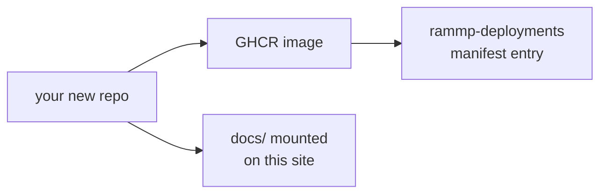

import { Cards, Callout } from 'nextra/components'

{/* Drafting note: _[bracketed italics]_ marks a phrase to replace, and a
    "> **Fill in** …" blockquote marks a whole section still to write. Inside
    code blocks, <angle-brackets> mark the values to replace. */}

# How to contribute

RAMMP is a polyrepo. A contribution is usually a whole repo of your own: a
module that ships as a Docker image, declares what it speaks in a fragment, and
is launched by [sheppy](/sheppy) alongside everyone else's.

> **Fill in** — one paragraph: _[the reader you have in mind — a new lab
> member, a visiting student, an outside collaborator — and what they should
> already have set up before they start.]_

## The shape of a contribution

| Stage | What you produce | Where it lives |
| --- | --- | --- |
| Write the module | A repo from the module template | `rammp-org/<your-repo>` |
| Declare what it speaks | A fragment listing topics in and out | your repo |
| Publish it | An image on GHCR | `ghcr.io/rammp-org/<your-repo>` |
| Deploy it | A manifest entry in a profile | `rammp-deployments` |
| Document it | A `docs/` directory composed into this site | your repo, mounted here |

## Start here

<Cards>
  <Cards.Card title="Add a new repo" href="/contributing/new-repo" arrow />
  <Cards.Card title="Publish its docs here" href="/contributing/publishing-docs" arrow />
  <Cards.Card title="How-to guide" href="/contributing/how-to" arrow />
  <Cards.Card title="Before you open the PR" href="/contributing/checklist" arrow />
</Cards>

## Other ways to help

Not every contribution is a new repo. These are smaller and just as welcome.

### Fix a page on this site

Every page has an **Edit this page on GitHub** link at the bottom. It opens the
file in the repo that owns it — this hub for the pages you see under
[Introduction](/), the source repo for composed sections like [sheppy](/sheppy).

### File an issue

> **Fill in** — _[which repo to file in when you are not sure, the labels you
> use, and what a good report includes for this project.]_

### Propose an interface change

Message types and topics are shared, so changing one affects every module that
listens. See [Interfaces](/interfaces) for the current map.

> **Fill in** — _[how a change to `rammp-ros2-interfaces` gets agreed on: who
> has to sign off, whether it needs a design record, how you stage it so
> nothing breaks mid-flight.]_

## Who to ask

| Topic | Ask | Where |
| --- | --- | --- |
| _[repo creation, org access]_ | _[name / role]_ | _[channel or email]_ |
| _[hardware, the chair itself]_ | _[name / role]_ | _[channel or email]_ |
| _[interfaces and topics]_ | _[name / role]_ | _[channel or email]_ |
| _[deployments and sheppy]_ | _[name / role]_ | _[channel or email]_ |

<Callout type="info">
  _[Standing meeting, office hours, or the one channel to join first — the
  thing you would tell someone on their first day.]_
</Callout>
