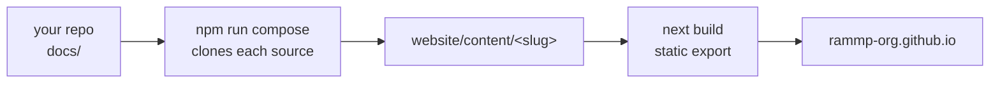

import { Steps, Callout, Cards, FileTree } from 'nextra/components'

{/* Drafting note: _[bracketed italics]_ marks a phrase to replace, and a
    "> **Fill in** …" blockquote marks a whole section still to write. Inside
    code blocks, <angle-brackets> mark the values to replace. */}

# Publish its docs here

Your pages live in your repo. This site pulls the `docs/` directory of every
source repo at build time and mounts it under a slug, so the docs ship with the
code that they describe and still read as one site.

## How composition works



`sources.yml` at the repo root is the list of what gets pulled in. Composition
runs on every `npm run dev` and `npm run build`, so the composed tree is never
committed — `website/content/<slug>` is generated.

The site rebuilds on pushes to this repo, on a `docs-updated`
`repository_dispatch` from a source repo, and on a schedule every six hours.

> **Fill in** — _[whether module repos send the `docs-updated` dispatch when
> their docs change, and if so the workflow snippet and the token it needs —
> or say that the six-hourly schedule is good enough and people should not
> worry about it.]_

## Write the pages in your repo

Everything under `docs/` is copied verbatim, so its layout becomes the layout
here.

<FileTree>
  <FileTree.Folder name="rammp-your-thing" defaultOpen>
    <FileTree.Folder name="docs" defaultOpen>
      <FileTree.File name="_meta.js" />
      <FileTree.File name="index.mdx" />
      <FileTree.File name="getting-started.mdx" />
      <FileTree.Folder name="guides">
        <FileTree.File name="_meta.js" />
      </FileTree.Folder>
    </FileTree.Folder>
  </FileTree.Folder>
</FileTree>

- **Format** — MDX, one `.mdx` per page, with a `title` in the frontmatter.
- **`_meta.js`** — every folder needs one; it sets the sidebar order and the
  label for each page. A page missing from `_meta.js` still builds, it just
  falls to the bottom of the sidebar.
- **`index.mdx`** — the landing page for your slug. Required.
- **Links** — use site paths (`/interfaces`), never
  `https://rammp-org.github.io/...`. The link checker fails on absolute URLs
  back to this site.
- **Assets** — files outside `docs/` are not copied unless you list them under
  `assets`.

> **Fill in** — _[where you draw the line — README for cloning and building
> the repo, these pages for how the module fits the system, or however you
> actually split it.]_

## Mount the repo on this site

<Steps>

### Add an entry to `sources.yml`

```yaml
- repo: rammp-org/your-repo
  slug: your-repo      # the path it mounts at: /your-repo
  title: Your repo     # how it is labelled in the sidebar
  ref: main            # optional, defaults to main
  assets: []           # files copied verbatim from the repo root, e.g. install.sh
  exclude: []          # paths inside docs/ to leave out, e.g. AGENTS.md
```

### Add the same slug to `website/content/_meta.js`

```js
export default {
  index: 'Introduction',
  // ...
  'your-repo': 'Your repo'
}
```

Both are required. A slug in `sources.yml` that is missing from `_meta.js`
fails the build outright — a composed section that is not in the sidebar is
unreachable, so compose refuses to produce one.

### Build the composed tree locally

```bash
cd website
npm install
npm run dev     # composes, then serves on http://localhost:3000
```

<Callout type="info">
  If your repo is checked out next to this one (`../your-repo` with a `docs/`
  directory), compose uses that working copy instead of cloning — so you can
  edit docs in your repo and see them here on refresh, before anything is
  pushed.
</Callout>

</Steps>

<Callout type="warning">
  **The usual mistakes.** _[Add the ones you hit yourself — a missing `_meta.js`, a relative link that worked in the repo's own renderer but not once mounted under a slug, an asset referenced but never declared.]_
</Callout>

## Checks that run on your PR

CI runs these against the composed site; all four have to pass.

| Check | Command | Fails when |
| --- | --- | --- |
| Composed build | `npm run build` | a source repo has no `docs/`, a slug is unmounted, or MDX does not compile |
| Unit tests | `npm test` | the compose and sources logic breaks |
| Links | `npm run check:links` | an internal link resolves to nothing, or points at an absolute `rammp-org.github.io` URL |
| Search | `npm run check:search` | a page in the output is missing from the search index |

Run them locally before you push:

```bash
cd website
npm run build && npm test && npm run check:links && npm run check:search
```

## Next

<Cards>
  <Cards.Card title="Before you open the PR" href="/contributing/checklist" arrow />
</Cards>
