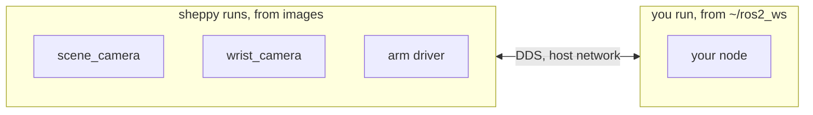

import { Callout, Steps } from 'nextra/components'

# Hybrid workflow

The recommended way to develop. sheppy runs the stable modules from images
and your code runs natively from `~/ros2_ws`. The reasoning is on the
[overview](/development).



## Set up your workspace

[Developer setup](/setup#workspace) created `~/ros2_ws` with the interfaces
repo in it and cloned `rammp-deployments`. If you skipped that page:

```bash
mkdir -p ~/ros2_ws/src && cd ~/ros2_ws/src
git clone --branch v1.0.0 https://github.com/rammp-org/rammp-interfaces-ros2.git
cd ~/ros2_ws
rosdep install --from-paths src --ignore-src -y
colcon build
git clone git@github.com:rammp-org/rammp-deployments.git ~/rammp-deployments
```

The tag is the one on [Software versions](/software#versions). It is the tag
compiled into the images, so a node built here speaks the same field layouts
as the containers. A mismatch is silent: on Humble, two builds of a type
connect by name even when their fields differ.

| Path | What it is |
| --- | --- |
| `~/ros2_ws/src/rammp-interfaces-ros2` | The shared message types, at the tag on [Software versions](/software#versions) |
| `~/ros2_ws/src/<your_package>` | Your code |
| `~/rammp-deployments/<deployment>/` | The manifest sheppy runs, and your profiles |

## Bring up the stable modules

Source your workspace so the `ros2` commands in this terminal see your
packages, then, from the deployment directory:

```bash
source ~/ros2_ws/install/setup.bash
cd ~/rammp-deployments/december_2026
sheppy up real-arm-cameras
sheppy status
```

`real-arm-cameras` selects the hardware alternative of every node.
`mock-arm-cameras` selects the mocks, for a workstation with nothing plugged
in. Every row in `status` reads `running`.

```bash
ros2 topic list     # /scene_camera/color/image_raw, /wrist_camera/color/image_raw, ...
```

Those topics come from containers. Your terminal sees them because the
containers run on the host network.

<Callout type="info">
  If sheppyd was started from a terminal without your workspace sourced, the
  nodes it starts do not see your packages. Run `sheppy down`, then bring it
  up again from a sourced terminal. See
  [ROS integration](/sheppy/ros-integration).
</Callout>

## Write a package and run it

The example is `rammp_hello`: one node that subscribes to the scene camera
and publishes how many frames it has received.

<Steps>

### Create the package

```bash
cd ~/ros2_ws/src
ros2 pkg create rammp_hello --build-type ament_python --dependencies rclpy sensor_msgs std_msgs
```

### Write the node

`rammp_hello/rammp_hello/frame_counter.py`:

```python
import rclpy
from rclpy.node import Node
from rclpy.qos import qos_profile_sensor_data
from sensor_msgs.msg import Image
from std_msgs.msg import UInt64


class FrameCounter(Node):
    def __init__(self):
        super().__init__('frame_counter')
        self.count = 0
        self.create_subscription(
            Image, '/scene_camera/color/image_raw', self.on_image,
            qos_profile_sensor_data)
        self.pub = self.create_publisher(UInt64, '~/frame_count', 10)
        self.create_timer(1.0, self.tick)

    def on_image(self, _msg):
        self.count += 1

    def tick(self):
        self.pub.publish(UInt64(data=self.count))


def main():
    rclpy.init()
    rclpy.spin(FrameCounter())


if __name__ == '__main__':
    main()
```

Register the executable in `setup.py`:

```python
entry_points={
    'console_scripts': [
        'frame_counter = rammp_hello.frame_counter:main',
    ],
},
```

### Add a launch file

sheppy can run an executable directly with `ros2 run`. The node gets a launch
file anyway, because the image built later runs one, and the native and image
alternatives should launch the same thing. `rammp_hello/launch/hello.launch.py`:

```python
from launch import LaunchDescription
from launch_ros.actions import Node


def generate_launch_description():
    return LaunchDescription([
        Node(package='rammp_hello', executable='frame_counter'),
    ])
```

Install it, in `setup.py`:

```python
data_files=[
    ('share/ament_index/resource_index/packages', ['resource/rammp_hello']),
    ('share/rammp_hello', ['package.xml']),
    ('share/rammp_hello/launch', ['launch/hello.launch.py']),
],
```

### Build and run

```bash
cd ~/ros2_ws
colcon build --packages-select rammp_hello
source install/setup.bash
ros2 launch rammp_hello hello.launch.py
```

In a second terminal:

```bash
ros2 topic echo /frame_counter/frame_count
```

The count rises while the camera runs under sheppy. This is the loop you
repeat: edit, `colcon build`, relaunch. The manifest did not change, and no
image was built.

</Steps>

## Let sheppy launch it (optional)

Running your node by hand with `ros2 launch`, as above, is a complete
workflow. You do not need this step to develop.

It is worth doing once your node is something other people will run. Adding
it to the manifest makes it part of the system: it starts and stops with
everything else, appears in `sheppy status`, and someone else can bring it up
without knowing how. A `launch_file` alternative runs `ros2 launch` from your
workspace, so every restart still runs your latest build.

Add a machine that names your workspace, and the node:

```yaml
machines:
  - name: dev
    host: localhost
    user: <your user>
    ros_setup: ~/ros2_ws/install/setup.bash

nodes:
  - name: frame_counter
    description: Counts scene camera frames
    select: single
    alternatives:
      - id: native
        kind: launch_file
        package: rammp_hello
        launch_file: hello.launch.py
        machine: dev
        subscribes:
          - /scene_camera/color/image_raw
        publishes:
          - /frame_counter/frame_count
```

`machine: dev` makes sheppy source `ros_setup` before the command. Without
it, the node gets only the environment sheppyd started with.

The `dev` machine, this alternative, and the `dev` profile are specific to
your workstation: `user` is your login and `ros_setup` is your workspace. Keep
them as a local, uncommitted edit to the manifest. The pull request that
publishes your module adds only the image alternative, as the
[deployment workflow](/development/deployment#ship-it) describes.

Open the TUI, select `frame_counter → native`, and press `space`. Press `s`
to save the selection as a profile named `dev`. From then on:

```bash
colcon build --packages-select rammp_hello
sheppy restart frame_counter
```

`sheppy up dev` restarts a node only when its command changed. A rebuild
does not change the command, so restart the node yourself to pick up the new
build.

## Next

When the node is ready to ship, the
[deployment workflow](/development/deployment) gives it an image alternative
beside this one. Nothing on this page is undone; you switch by profile.
