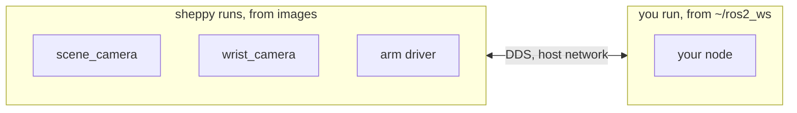

import { Callout, Steps } from 'nextra/components'

# Development flow

How to write a ROS 2 node that talks to this robot, and how it gets from your
workspace onto the chair.

The robot's stable parts, the cameras and the arm driver, run as containers
that [sheppy](/sheppy) pulls and supervises. Your code runs natively in
`~/ros2_ws`, built with `colcon` and started with `ros2 launch`. Both are on
the same DDS network, so your node sees their topics and they see yours.
Docker enters only when you deploy.



The only RAMMP source you build is
[rammp-interfaces-ros2](/interfaces), for the message types. Everything else
is an image.

## Set up your workspace

Assumes a machine that has been through [Developer setup](/setup) with ROS 2
Humble installed.

```bash
mkdir -p ~/ros2_ws/src && cd ~/ros2_ws/src
git clone https://github.com/rammp-org/rammp-interfaces-ros2.git
cd ~/ros2_ws
rosdep install --from-paths src --ignore-src -y
colcon build
source install/setup.bash
```

Clone the deployment manifests next to it:

```bash
git clone git@github.com:rammp-org/rammp-deployments.git ~/rammp-deployments
```

| Path | What it is |
| --- | --- |
| `~/ros2_ws/src/rammp-interfaces-ros2` | The shared message types, at the tag on [Software versions](/software#versions) |
| `~/ros2_ws/src/<your_package>` | Your code |
| `~/rammp-deployments/<deployment>/` | The manifest sheppy runs, and your profiles |

## Bring up the robot

sheppyd gives every node a copy of the environment of the terminal that
started it, so source your workspace first. Then, from the deployment
directory:

```bash
source ~/ros2_ws/install/setup.bash
cd ~/rammp-deployments/december_2026
sheppy up real-arm-cameras
sheppy status
```

`real-arm-cameras` selects the hardware alternative of every node.
`mock-arm-cameras` selects the mocks, for a workstation with nothing plugged
in. Every row in `status` reads `running`.

```bash
ros2 topic list     # /scene_camera/color/image_raw, /wrist_camera/color/image_raw, ...
```

<Callout type="info">
  If sheppyd was started from a terminal without your workspace sourced, the
  nodes it starts do not see your packages. Run `sheppy down`, then bring it
  up again from a sourced terminal. See
  [ROS integration](/sheppy/ros-integration).
</Callout>

## Write a package and run it

The example is `rammp_hello`: one node that subscribes to the scene camera
and publishes how many frames it has received.

<Steps>

### Create the package

```bash
cd ~/ros2_ws/src
ros2 pkg create rammp_hello --build-type ament_python --dependencies rclpy sensor_msgs std_msgs
```

### Write the node

`rammp_hello/rammp_hello/frame_counter.py`:

```python
import rclpy
from rclpy.node import Node
from rclpy.qos import qos_profile_sensor_data
from sensor_msgs.msg import Image
from std_msgs.msg import UInt64


class FrameCounter(Node):
    def __init__(self):
        super().__init__('frame_counter')
        self.count = 0
        self.create_subscription(
            Image, '/scene_camera/color/image_raw', self.on_image,
            qos_profile_sensor_data)
        self.pub = self.create_publisher(UInt64, '~/frame_count', 10)
        self.create_timer(1.0, self.tick)

    def on_image(self, _msg):
        self.count += 1

    def tick(self):
        self.pub.publish(UInt64(data=self.count))


def main():
    rclpy.init()
    rclpy.spin(FrameCounter())


if __name__ == '__main__':
    main()
```

Register the executable in `setup.py`:

```python
entry_points={
    'console_scripts': [
        'frame_counter = rammp_hello.frame_counter:main',
    ],
},
```

### Add a launch file

sheppy launches packages through their launch files.
`rammp_hello/launch/hello.launch.py`:

```python
from launch import LaunchDescription
from launch_ros.actions import Node


def generate_launch_description():
    return LaunchDescription([
        Node(package='rammp_hello', executable='frame_counter'),
    ])
```

Install it, in `setup.py`:

```python
data_files=[
    ('share/ament_index/resource_index/packages', ['resource/rammp_hello']),
    ('share/rammp_hello', ['package.xml']),
    ('share/rammp_hello/launch', ['launch/hello.launch.py']),
],
```

### Build and run

```bash
cd ~/ros2_ws
colcon build --packages-select rammp_hello
source install/setup.bash
ros2 launch rammp_hello hello.launch.py
```

In a second terminal:

```bash
ros2 topic echo /frame_counter/frame_count
```

The count rises while the camera runs under sheppy. This is the loop: edit,
`colcon build`, relaunch. The manifest did not change.

</Steps>

## Let sheppy launch it

Add the node to the manifest so it starts and stops with the rest of the
system and appears in `sheppy status`. A `launch_file` alternative runs
`ros2 launch` from your workspace, so every restart runs your latest build.

Add a machine that names your workspace, and the node:

```yaml
machines:
  - name: dev
    host: localhost
    user: <your user>
    ros_setup: ~/ros2_ws/install/setup.bash

nodes:
  - name: frame_counter
    description: Counts scene camera frames
    select: single
    alternatives:
      - id: native
        kind: launch_file
        package: rammp_hello
        launch_file: hello.launch.py
        machine: dev
        subscribes:
          - /scene_camera/color/image_raw
        publishes:
          - /frame_counter/frame_count
```

`machine: dev` makes sheppy source `ros_setup` before the command. Without
it, the node gets only the environment sheppyd started with.

Open the TUI, select `frame_counter → native`, and press `space`. Press `s`
to save the selection as a profile named `dev`. From then on:

```bash
colcon build --packages-select rammp_hello
sheppy restart frame_counter
```

`sheppy up dev` restarts a node only when its command changed. A rebuild
does not change the command, so restart the node yourself to pick up the new
build.

## Containerize it for deployment

The chair runs every node from an image. When the package is ready to ship,
give the node a second alternative that runs the image, and a profile that
selects it. The native alternative stays. You switch between them by
profile.

Build the image from the RAMMP-docker template, as on
[Build and publish](/publishing/build-and-publish):

```bash
cd ~/ros2_ws/src/rammp_hello
docker build -t rammp_hello:dev .
```

Add the alternative beside the first:

```yaml
      - id: image
        kind: docker
        container:
          image: rammp_hello:dev
          network_mode: host
          ipc: host
          environment:
            ROS_DOMAIN_ID: "0"
        subscribes:
          - /scene_camera/color/image_raw
        publishes:
          - /frame_counter/frame_count
```

Select `frame_counter → image`, save the profile as `deploy`, and run
`sheppy up deploy`. The node now runs the way it will on the chair. When it
behaves the same as the native one, continue with
[Publishing a module](/publishing): CI builds the image, the manifest in
`rammp-deployments` pins its release tag, and the node joins the
`real-arm-cameras` profile.

## Other ways to run the robot

### Everything from source

Clone the core packages into `~/ros2_ws` and run the stable stack natively
instead of from images. Use this when you are changing a core package, or on
a machine that cannot pull images.

| Package | Get it |
| --- | --- |
| Arm driver | `git clone https://github.com/rammp-org/kinova-gen3-ros2.git` into `src/`. It vendors `kinova-gen3-driver` through its `.repos` file. |
| Cameras | `sudo apt install ros-humble-orbbec-camera ros-humble-realsense2-camera`. The camera images contain these packages and nothing else. |
| Base driver | Does not exist yet. |

Then give each node a `launch_file` alternative on the `dev` machine, the
same shape as `frame_counter → native`, and save a profile that selects them.

### Everything in containers

The `real-arm-cameras` profile. Every node runs from a pinned image, which
is what the chair does at deploy time. Use it to rehearse a deployment or to
reproduce a problem seen on the chair. Your own node joins it through
[Publishing a module](/publishing).

## Next

- [Git workflow](/development/git-workflow) — branching, pull requests, and
  review.
- [Publishing a module](/publishing) — from a working image to a node in the
  deployment.
