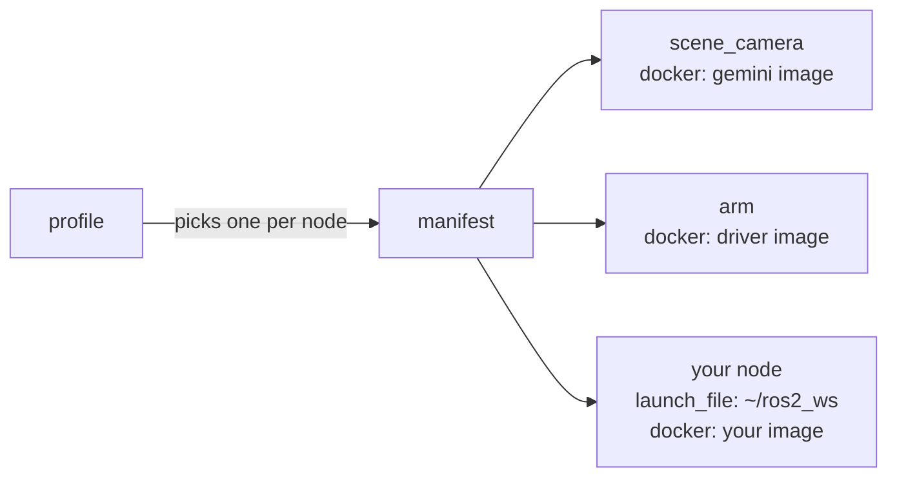

# Development flow

RAMMP software is written by several labs, on several machines, and has to
end up running on one chair. The development flow exists to make two things
easy at once: developing, and deploying. Those pull in different directions.
Deploying wants every node frozen in a container so the chair runs exactly
what was tested. Developing wants the shortest possible path from an edit to
a running node, and a container rebuild is not short.

This page explains the parts and how they fit. The three pages after it are
the workflows.

## What we are optimizing for

| Goal | What serves it |
| --- | --- |
| Distributed development | Stable modules ship as pinned images. A lab that needs the arm driver pulls the image; nobody builds another lab's code from source to use it. |
| Easy deployment | Every module carries a Dockerfile. The image you tested is the image the chair runs. |
| Code sharing | One [interfaces repo](/interfaces) is the contract, and it is compiled into every image. A module that speaks it works with every other module that does. |
| Short time to test | Your own code runs natively from `~/ros2_ws`. The test loop is `colcon build` and a relaunch, seconds, not a `docker build`. |

## The moving parts

**Images** are the stable modules: the camera drivers, the arm driver, and
every module that has been published. Each is built from its own repo and
pinned by tag. You pull them; you do not build them.

**Your workspace**, `~/ros2_ws`, is where your code lives and builds. The
only RAMMP source in it is the interfaces repo, so your node has the message
types. Nodes you launch from here are on the same DDS network as the images,
because every container runs on the host network.

**sheppy** launches and supervises nodes, whichever way they run. Its
[manifest](/sheppy/manifest) lists each node with one or more
**alternatives**: the same node can have a `docker` alternative that runs an
image and a `launch_file` alternative that runs `ros2 launch` from your
workspace. A **profile** picks one alternative per node. Switching from
developing a node to deploying it is switching which alternative the profile
selects. Nothing else in the manifest changes.

That is the whole model. Stable things are images, your thing is a
workspace, sheppy runs both, and a profile says which.

## The three workflows

| | Stable modules run as | Your code runs as | Use it |
| --- | --- | --- | --- |
| [Hybrid](/development/hybrid) | Images, under sheppy | Native, from `~/ros2_ws` | Day to day. This is the recommended workflow. |
| [Fully native](/development/native) | Native, cloned into `~/ros2_ws` | Native | When you need to change a stable module itself, or cannot pull images. Not recommended otherwise. |
| [Deployment](/development/deployment) | Images, under sheppy | An image, under sheppy | When your module is ready to ship. This is what the chair runs. |

**Hybrid** is the default because it gives you both goals. The stable stack
comes up with one `sheppy up`, pinned to the same versions every other lab
runs, and your code stays in the fast native loop.

**Fully native** gives you complete control: every line of the stack is in
your workspace, and you can change any of it. The cost is that you are now
building and maintaining other labs' code, and your stack drifts from the
pinned images the chair runs. Use it when the hybrid workflow cannot do what
you need.

**Deployment** is the hybrid workflow with your node switched to its image
alternative. It exists so that "works on my machine" and "works on the
chair" are the same test. Run it before you open the pull request that
publishes your module.

The [Git workflow](/development/git-workflow) applies throughout: every
change to every repo arrives through a reviewed pull request.
