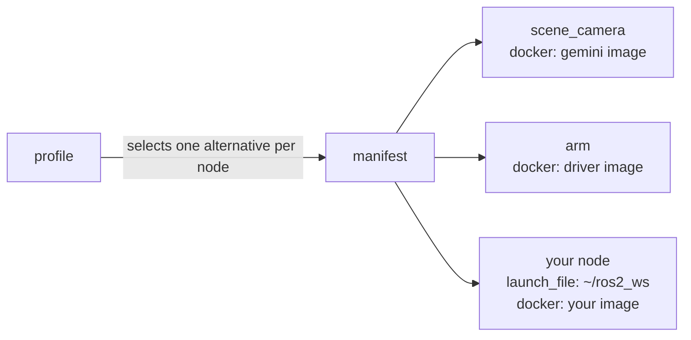

# Development flow

RAMMP software comes from several labs, each with its own codebase and its
own dependencies, and all of it has to run together on one chair. To make
that workable, every module ships as a Docker image. Sharing code between
labs becomes pulling an image rather than building someone else's source and
reconciling its dependencies with yours. Deploying is the same act: the chair
runs the images that were tested, pinned by tag, and nothing else.

Images are slow to iterate on. An edit that takes seconds to test with
`colcon build` takes minutes through `docker build`, and the manifest has to
be edited to point at every new tag. So your own code does not run from an
image while you are developing it. It runs natively from `~/ros2_ws`, next
to the images, and is containerized once it is ready to ship.

## How the pieces fit

The stable modules, the camera drivers, the arm driver, and every published
module, run as containers on the host network. A node you launch from your
workspace is on the same DDS network and sees their topics directly. The
message types are shared through [rammp-interfaces-ros2](/interfaces), which
is compiled into every image and is the one RAMMP repo you build in your
workspace.

[sheppy](/sheppy) launches and supervises nodes in either form. In its
manifest a node can have more than one alternative: a `docker` alternative
that runs an image, and a `launch_file` alternative that runs `ros2 launch`
from your workspace. A profile selects one alternative per node. Moving your
node from development to deployment is a change of profile, not a change to
the manifest.

## The three workflows

What you are doing determines how the stable modules and your own code run.
Each combination is a workflow, and each has its own page with the setup and
a worked example.

| | Stable modules run as | Your code runs as | Use it |
| --- | --- | --- | --- |
| [Hybrid](/development/hybrid) | Images, under sheppy | Native, from `~/ros2_ws` | Day to day. The recommended workflow. |
| [Fully native](/development/native) | Native, cloned into `~/ros2_ws` | Native | Changing a stable module itself, or a machine that cannot pull images. Not recommended otherwise. |
| [Deployment](/development/deployment) | Images, under sheppy | An image, under sheppy | Checking a module is ready to ship. This is what the chair runs. |

**Hybrid.** The stable stack comes up with one `sheppy up`, pinned to the
same versions every other lab runs, and your code stays in the native build
loop.

**Fully native.** Every line of the stack is in your workspace and you can
change any of it. In exchange you build and maintain other labs' code, and
your stack drifts from the pinned images the chair runs. Use it when the
hybrid workflow cannot do what you need.

**Deployment.** The hybrid workflow with your node switched to its image
alternative, so that "works on my machine" and "works on the chair" are the
same test. Run it before you open the pull request that publishes your
module.

The [Git workflow](/development/git-workflow) applies throughout: every
change to every repo arrives through a reviewed pull request.
