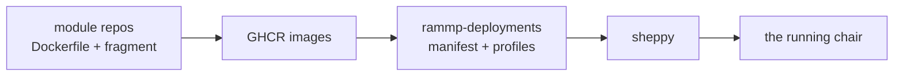

import { Cards } from 'nextra/components'

# RAMMP

Wireframe. RAMMP is a polyrepo: each functional module ships a Docker container,
declares what it speaks in a fragment, and is launched by
[sheppy](/sheppy).

## Where to go next

<Cards>
  <Cards.Card title="The platform" href="/platform" arrow />
  <Cards.Card title="Interfaces" href="/interfaces" arrow />
  <Cards.Card title="Build a module" href="/building" arrow />
</Cards>
