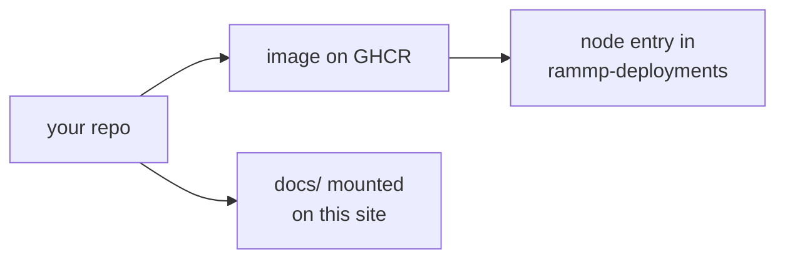

import { Cards } from 'nextra/components'

# Publishing a module

RAMMP is a polyrepo. Each module lives in its own repository, builds into its
own Docker image, and is launched on the chair by [sheppy](/sheppy) alongside
everyone else's. Publishing a module means getting it from a repo to a node
in the deployment manifest.

| Stage | What you produce | Where it lives |
| --- | --- | --- |
| Build it | A Dockerfile from the RAMMP-docker template, `FROM` a pinned base image | `rammp-org/<your-repo>` |
| Publish it | An image on GHCR, tagged by CI on a release tag | `ghcr.io/rammp-org/<your-repo>` |
| Deploy it | A node entry with a real and a mock alternative | `rammp-deployments` |
| Document it | A `docs/` directory composed into this site | your repo, mounted here |

## Pages

<Cards>
  <Cards.Card title="Base images" href="/publishing/base-images" arrow />
  <Cards.Card title="Build and publish" href="/publishing/build-and-publish" arrow />
  <Cards.Card title="Deploy it" href="/publishing/deploy" arrow />
  <Cards.Card title="Before you open the PR" href="/publishing/checklist" arrow />
</Cards>

The branching and pull request conventions are on
[Git workflow](/development/git-workflow). The message types your module
speaks come from [rammp-interfaces-ros2](/interfaces/rammp-interfaces-ros2).
